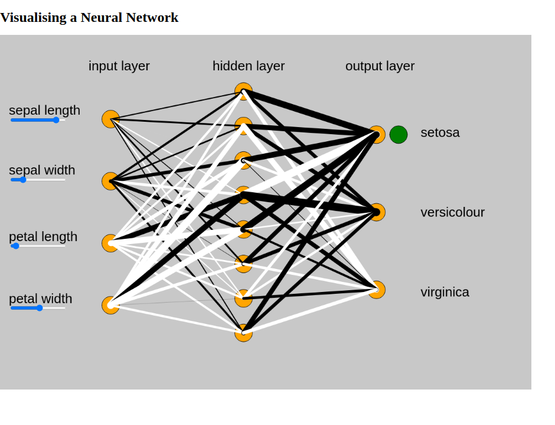
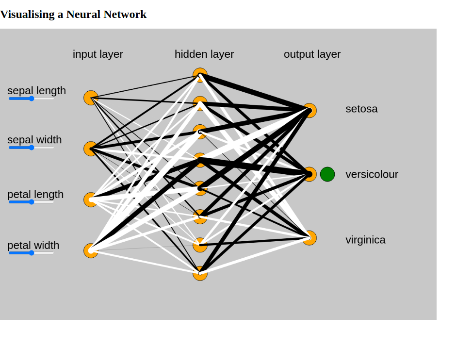
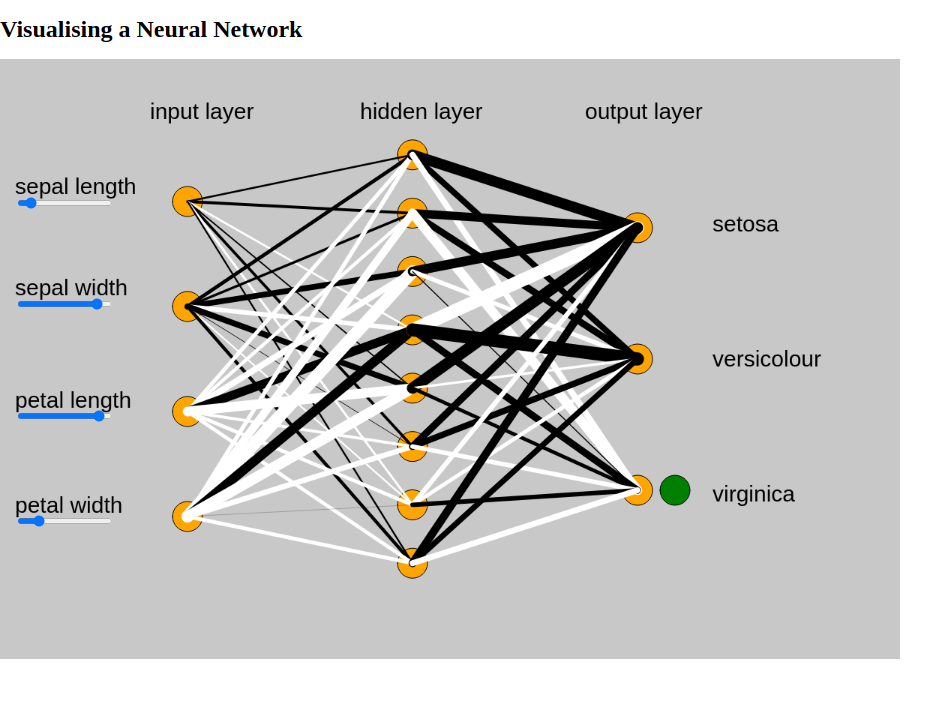

# Visualising NNs

This was a project to help visualise the workings of a neural network with the help of the P5.js library. The initial plan was to do it on the rather popular MNIST dataset (that's what main_notebook.py is for). The final product uses a more straightforward to understand iris dataset from sklearn (from [here](https://scikitlearn.org/stable/auto_examples/datasets/plot_iris_dataset.html)). The four input parameters are readily manipulated with sliders from P5.js. The model is built in python using TF and Keras, ported over to TFJS and used to display weights and predictions there.

### Interpretation
Black represents negative correlation while white represents positive correlation, and the thickness of the line shows the strength of the correlation. The green circle shows the predicted output based on the given inputs from the sliders.

### Usage 
To start of by using the current model clone this repo, and run 
```
npm install
npm start
```
To use a custom model, make your model in Simplified_main.py inplace of the existing one and run the entire notebook. In sketch.js, add and rearange layers as you see fit.

### Screenshots: 



